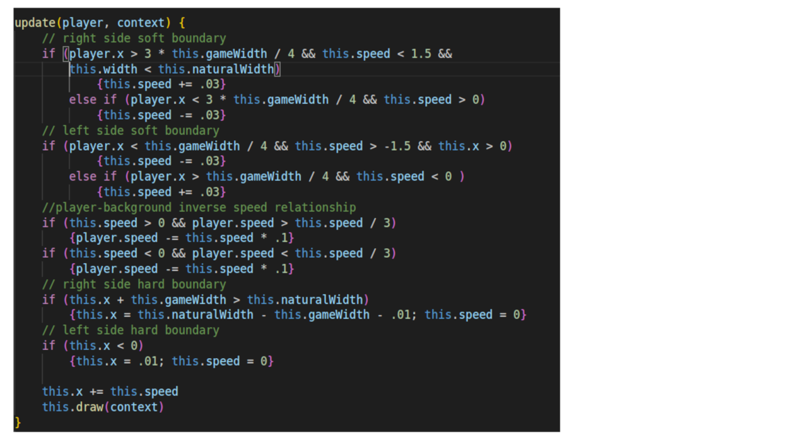

# Welcome to Hellocopter

This project will allow me to develop my skills with vanilla JavaScript and the Canvas API. The result will be a functional sidescrolling helicopter game, rendered in 2D, featuring pixel art, collision detection, simple animations, intertia-like and gravity-like behavior, moving enemies, and victory/defeat logic. Reach goals include background parallax, dynamic enemies, and multiple canvases and levels. 

In Hellocopter, the player will assume the role of a helicopter pilot. The objective will be to rescue a capybara from hostile territory, avoiding projectiles from static defenses as well as enemy jets and helicopters. Most of the elements will be in the background, but some foreground elements, such as power lines and bridges, will damage the Hellocopter unless they are avoided in flight. The Hellocopter pilot must travel to a point on the opposite side of the map from the spawn location, land to pick up the capybara, and then traverse the map in the opposite direction, landing again at the spawn location. Successful traversal of the map will trigger a Victory screen.

[Live Link](https://wtdavis.github.io/hellocopter_js_project/)
## Functionality & MVPs

### Features:

-Player can traverse a map with soft boundaries that moves to keep player on screen \
-Player character exhibits physics-like behavior with intertia and momentum, lift and speed applied over time during input \
-Player character exhibits animated sprites \
-Collision detection with moving and static onscreen elements \
-Enemies are programatically customizable

### Future functionality:

-Simple sound design and music\
-Multiple levels\
-Dynamic enemy generation, dynamic difficulty scaling

## Project Layout Preview

## Technologies, Libraries, APIs
This project will use Canvas to render the game in a browser window, and Javascript for the game logic. \
-[Canvas API](https://developer.mozilla.org/en-US/docs/Web/API/Canvas_API)\
-[Vanilla JavaScript](https://developer.mozilla.org/en-US/docs/Web/JavaScript)

Implementation Timeline

Friday: Learned canvas basic methods and workflow. Discovered some of the quirks of animating based on screen refresh rate.\
Saturday: Recreated physics and input handling due to bugs. Learned basic GIMP tools for creating and modifying art assets.\
Sunday: Discovered the stacked nature of my challenges- player, background, canvas, enemies, and projectiles all had distinct movement characteristics. Sorted out how to track the relative motion of all objects.\
Monday: Flushed out enemy and projectile characteristics, allowing fine-tuning for enemy movement and firing patterns, projectile size and speed.\
Tuesday: Polished, added more sprites, tweaked enemy and projectile handlers, tweaked physics. Fixed bugs around canvas-edge soft and hard boundaries.\
Wednesday: Styled landing page, created splash screen for start/win/loss/restart conditions.\
Thursday Morning: Uploaded and polished styling, last minute bug fixes.\

Code feature: Background Scrolling

One challenge I faced was to make the character able to move to the edge of the screen, and have the background speed increase as their speed decreased, so as neither to break the illusion of momentum nor to create collision hazards near the screen's edge:

Here, the screen accelerates up to a point, as the player decelerates. The background will not move past its edge, nor will the player's movement relative to other elements onscreen increase beyond its normal maximum.

