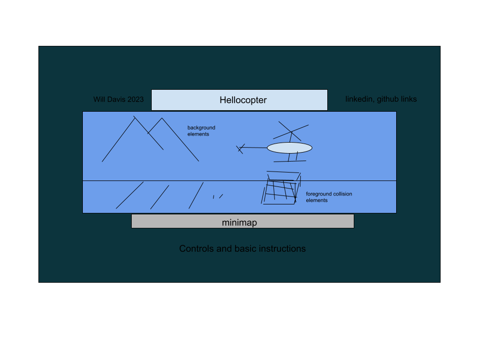

# Welcome to Hellocopter

This project will allow me to develop my skills with vanilla JavaScript and the Canvas API. The result will be a functional sidescrolling helicopter game, rendered in 2D, featuring pixel art, collision detection, simple animations, intertia-like and gravity-like behavior, moving enemies, and victory/defeat logic. Reach goals include background parallax, dynamic enemies, and multiple canvases and levels. 

In Hellocopter, the player will assume the role of a helicopter pilot. The objective will be to rescue a capybara from hostile territory, avoiding projectiles from static defenses as well as enemy jets and helicopters. Most of the elements will be in the background, but some foreground elements, such as power lines and bridges, will damage the Hellocopter unless they are avoided in flight. The Hellocopter pilot must travel to a point on the opposite side of the map from the spawn location, land to pick up the capybara, and then traverse the map in the opposite direction, landing again at the spawn location. Successful traversal of the map will trigger a Victory screen.

[Live Link] (https://wtdavis.github.io/hellocopter_js_project/)
## Functionality & MVPs

In Hellocopter, players will be able to:

-Traverse a premade map using keyboard controls \
-Experience physics-like behavior \
-Achieve objectives by maneuvering to specific locations\
-Enjoy pixel art brought to life by simple animations

### In addition, this project may include:

-Simple sound design and music\
-Multiple levels\
-Facts about capybaras

## Project Layout Preview

## Technologies, Libraries, APIs
This project will use Canvas to render the game in a browser window, Javascript for the game logic, and Webpack to transpile the JS files. \
-[Canvas API](https://developer.mozilla.org/en-US/docs/Web/API/Canvas_API)\
-[Vanilla JavaScript](https://developer.mozilla.org/en-US/docs/Web/JavaScript)

Implementation Timeline

Friday: Learned canvas basic methods and workflow. Discovered some of the quirks of animating based on screen refresh rate.\
Saturday: Recreated physics and input handling due to bugs. Learned basic GIMP tools for creating and modifying art assets.\
Sunday: Discovered the stacked nature of my challenges- player, background, canvas, enemies, and projectiles all had distinct movement characteristics. Sorted out how to track the relative motion of all objects.\
Monday: Flushed out enemy and projectile characteristics, allowing fine-tuning for enemy movement and firing patterns, projectile size and speed.\
Tuesday: Polished, added more sprites, tweaked enemy and projectile handlers, tweaked physics. Fixed bugs around canvas-edge soft and hard boundaries.\
Wednesday: Styled landing page, created splash screen for start/win/loss/restart conditions.\
Thursday Morning: Uploaded and polished styling, last minute bug fixes.\

### project progress checklist

Production README
☐ Link to live version.

☐ Instructions on how to play/interact with the project.

☐ List of technologies / libraries / APIs used.

☐ Technical implementation details with (good-looking) code snippets.

☐ To-dos / future features.

☐ No .DS_Store files / debuggers / console.logs.

☐ Organized file structure, with /src and /dist directories.
